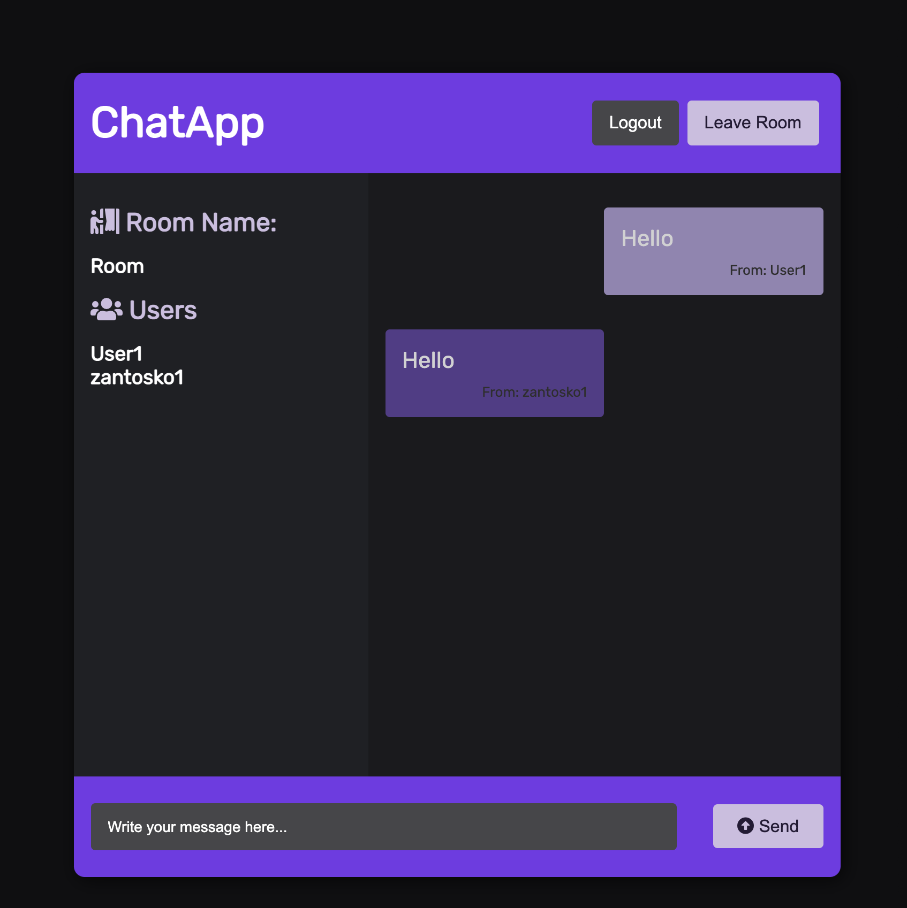
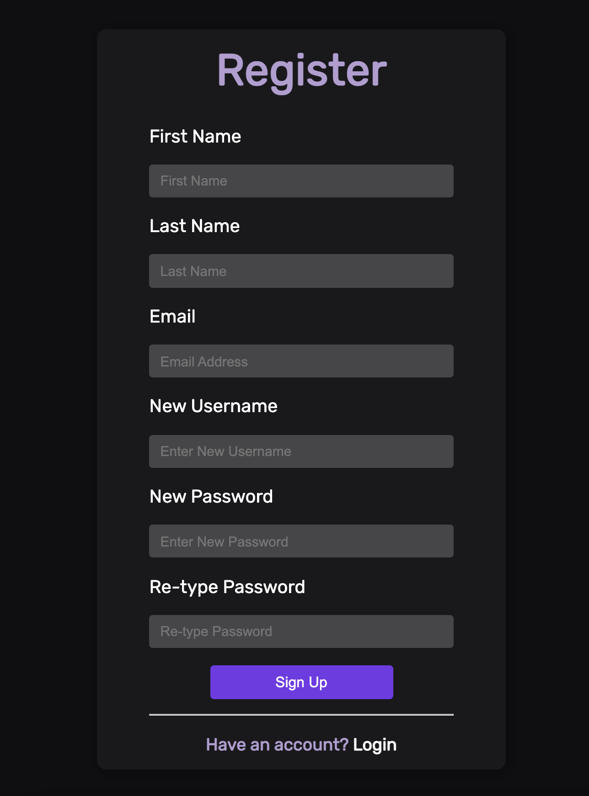
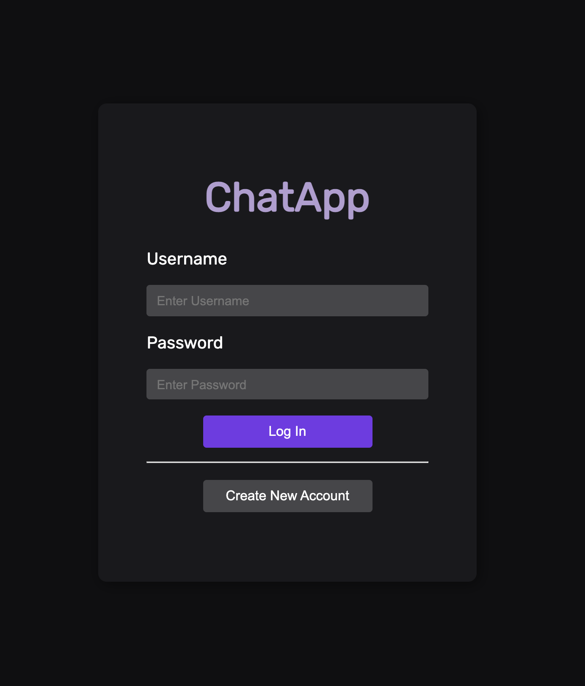
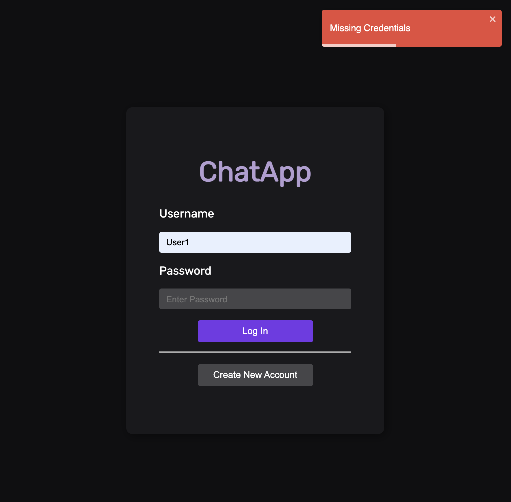
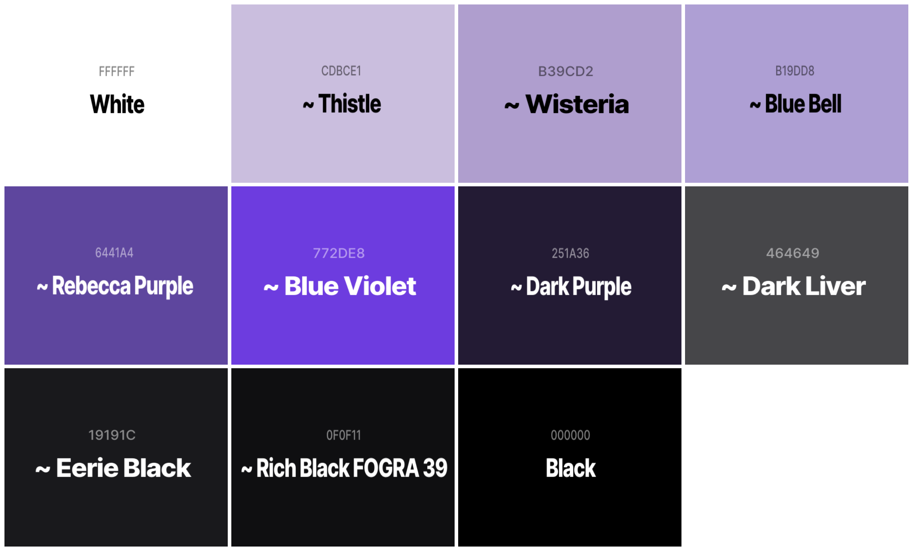

# 💬 React ChatApp – Real-Time Messaging Platform

  <h1>⚡ Modern Web Chat Application</h1>
  
<strong>Secure, real-time messaging with JWT authentication and WebSockets</strong>

  

    
    
    
    
  

---

## 📸 Screenshots

  
  
  
    
  
  
  

---

## ✨ Features

| Feature               | Description                                                              |
|-----------------------|--------------------------------------------------------------------------|
| 🔐 **JWT Auth**        | Secure login and registration with token-based authentication            |
| ⚡ **Real-Time Chat**  | Instant messaging with WebSocket communication via Socket.io             |
| 💬 **Persistent Chat** | Conversations stored securely in PostgreSQL                             |
| 📢 **Notifications**  | User feedback with React Toastify                                        |
| 🎨 **Styled UI**       | Consistent look & feel with Styled Components                           |

---

## 🛠️ Tech Stack

### 🔹 Frontend
- React.js
- Redux
- React Router
- Styled Components
- Socket.io-client
- React Toastify

### 🔸 Backend
- Node.js + Express
- PostgreSQL + Sequelize
- Socket.io
- Bcrypt
- JWT (JSON Web Tokens)

---

## 🚀 Getting Started

### ✅ Prerequisites
- Node.js v14+
- PostgreSQL installed and running

---

### 📦 Installation

``bash
# 1. Clone the repo
git clone https://github.com/your-username/react-chatapp.git
cd react-chatapp

# 2. Install client dependencies
cd client
npm install

# 3. Install server dependencies
cd ../server
npm install

⚙️ Configuration
Create .env files in both client/ and server/ directories.

Sample .env for server:
env
Copy
Edit
PORT=5000
DB_NAME=your_database_name
DB_USER=your_username
DB_PASSWORD=your_password
DB_HOST=localhost
JWT_SECRET=your_jwt_secret
▶️ Running the App
bash
Copy
Edit
# Start the backend server
cd server
npm start

# In a new terminal, start the frontend
cd ../client
npm start
📚 What I Learned
🔧 How WebSockets and real-time messaging work with Socket.io

🔐 Building secure authentication flows with JWT

⚛️ Managing global state using Redux

🗃️ PostgreSQL database modeling using Sequelize ORM

🧑‍🎨 Responsive UI development using Styled Components

🧩 Challenges Faced
Socket.io Integration: Managing real-time connections and user sessions

JWT Auth: Refreshing tokens, securing routes

Redux with Sockets: Syncing socket events with app state

DB Modeling: Designing scalable message schema

UX Handling: Toasts, error states, and feedback

🔮 Future Enhancements
✅ Read receipts

📁 File sharing

📣 Chat rooms/channels

⌨️ Typing indicators

🟢 Online/offline presence detection

🤝 Contributing
Contributions are welcome! 🚀

Fork the repo

Create a new branch: git checkout -b feature/FeatureName

Commit your changes: git commit -m 'Add feature'

Push to the branch: git push origin feature/FeatureName

Open a Pull Request

